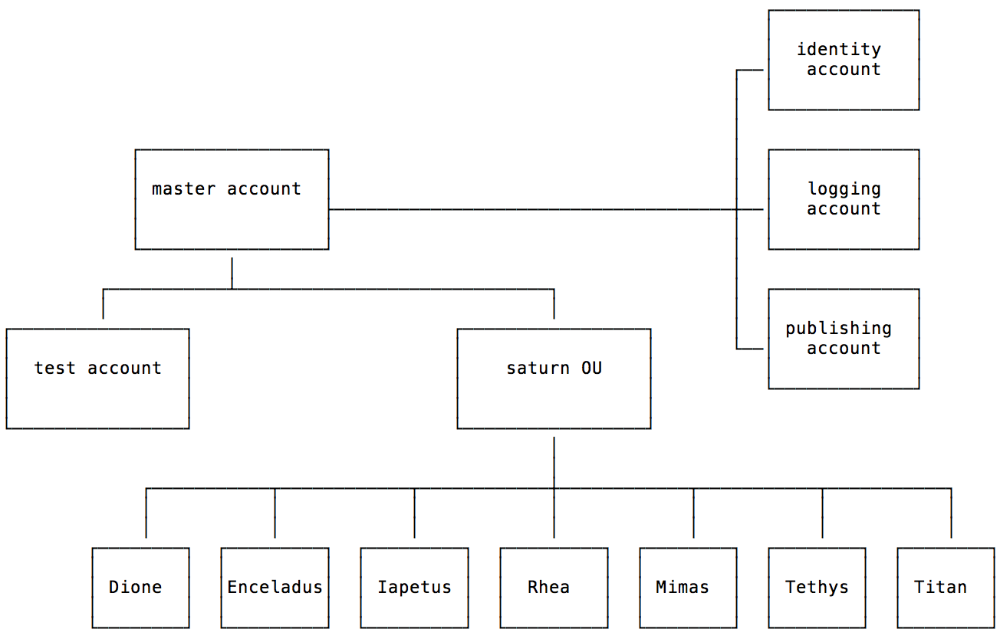

content for the space-odyssey workshop



organisation of files:

- [doc](doc): documentation including instructions
- [workshop](workshop): utility automation to run workshop
- [templates](templates): CloudFormation templates. 
  - Under [bootstrap](templates/bootstrap): to be provisioned by hand
  - Under [automated](templates/automated): to be provisioned by automation
- [functions](functions): Lambda functions implementing automation  
- [iam](iam): IAM policies for illustration (use with Cross Account Manager)
- [executor](executor) and [build specification](buildspec.yml): code for project in CodeBuild

Begin with the [overview](doc/overview.md)

(IMPORTANT: Use ```us-east-1``` as the AWS region chosen to provision resources)
